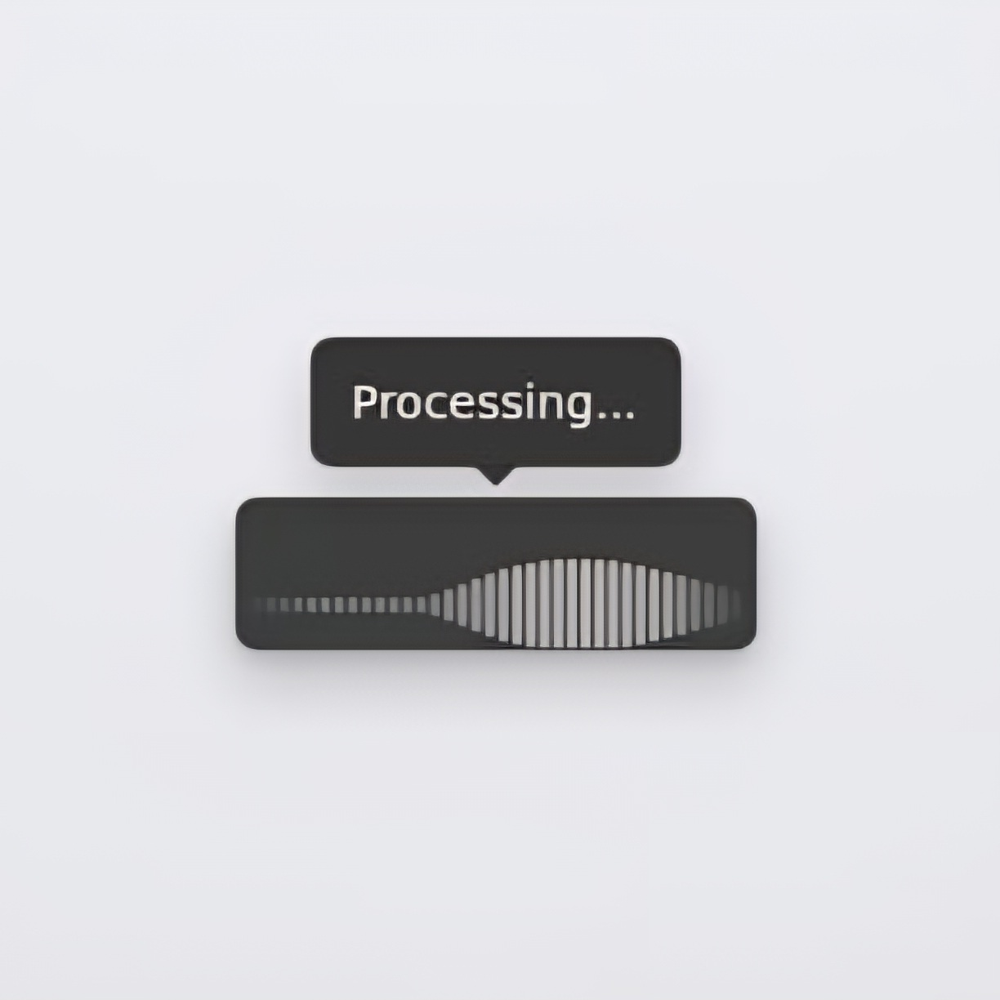

# VoiceKey 🎙️

**Push-to-talk voice keyboard for Windows, powered by [Voxtral](https://mistral.ai/news/voxtral/).**

Hold a hotkey → speak → release → your words are typed anywhere on screen.

---

## Features

- 🎤 **Push-to-talk** — hold your hotkey, speak, release; text appears instantly
- ⌨️ **Types anywhere** — works in any app: browser, Word, Slack, VS Code, etc.
- 🔔 **System tray** — runs quietly in the background, coloured icon shows state
- ⚙️ **Configurable** — hotkey, language, paste mode, model, API endpoint
- 🚀 **Windows startup** — optionally auto-starts with Windows

## End-user install status

VoiceKey is **not yet shipped as a one-click installer** (`.msi`/setup) or a true **single self-contained executable**.

Current packaging is a **portable folder build** created with PyInstaller `--onedir`:

- `dist\VoiceKey\VoiceKey.exe`
- plus required runtime files in the same folder

That means users must keep the full `dist\VoiceKey` folder together.

For complete user-facing installation steps, see **[`docs/USER_INSTALLATION.md`](docs/USER_INSTALLATION.md)**.

## Quick Start (run from source)

**1. Install dependencies**

```bash
pip install -r requirements.txt
```

**2. Set your API key in Settings**

Start the app, then right-click the tray icon and open **Settings**.
Paste your API key and click **Save**.

**3. Run**

```bash
python voicekey.py
```

The app starts in the system tray (bottom-right). Right-click → **Settings** to configure your API key.

**4. Get an API key**

Sign up at [console.mistral.ai](https://console.mistral.ai) — Voxtral is available on all paid plans.

---

## Usage

| Action | How |
|--------|-----|
| Start recording | Hold **Right Alt** |
| Stop & transcribe | Release the hotkey |
| Open Settings | Right-click tray icon → **Settings** |
| Quit | Right-click tray icon → **Quit** |

### Tray icon states

| Color | State |
|-------|-------|
| 🔘 Dark gray | Idle — ready |
| 🔴 Red | Recording |
| 🟠 Orange | Transcribing |

## App screenshots (latest update)

### Listening (idle)


### Listening (active)


### Processing



---

## Configuration

Settings are stored in `%APPDATA%\VoiceKey\config.json` and managed through the Settings window.

| Setting | Default | Description |
|---------|---------|-------------|
| `api_key` | *(empty)* | API key used for transcription |
| `endpoint` | `https://api.mistral.ai/v1/audio/transcriptions` | Transcription endpoint |
| `model` | `voxtral-mini-latest` | Voxtral model |
| `hotkey` | `right alt` | Push-to-talk key |
| `language` | `auto` | Transcription language (`auto`, `en`, `nl`, `de`, `fr`, …) |
| `paste_mode` | `true` | Clipboard paste (faster) vs. keystroke-by-keystroke |
| `sample_rate` | `16000` | Microphone sample rate (Hz) |

API key source: `config.json` (`api_key`) set from the Settings window.

---

## Build portable EXE bundle (developer)

```bat
build.bat
```

Output: `dist\VoiceKey\VoiceKey.exe`.

Important: this is a **folder-based bundle**, not a single self-contained executable. Share the full `dist\VoiceKey` directory with users.

Requires PyInstaller (`pip install pyinstaller`). The build script installs it automatically.

### Full Windows build (backend + overlay)

If you want the Python backend and Tauri overlay both buildable on Windows:

1. Install prerequisites on Windows:
   - Python 3.11+
   - Node.js + pnpm
   - Rust toolchain (`rustup`) with MSVC
   - Visual Studio Build Tools (Desktop development with C++)
2. Build backend:

```bat
build.bat
```

3. Build overlay app:

```bat
cd overlay-ui
pnpm install
pnpm build
```

Overlay artifacts are produced in `overlay-ui/src-tauri/target/release/bundle/`.

---

## Tauri Overlay UI (React + Tailwind/shadcn-style)

An experimental desktop overlay UI is available in `overlay-ui/`.

Run it:

```bash
cd overlay-ui
pnpm install
pnpm dev
```

It listens for overlay state payloads on UDP `127.0.0.1:38485`.
See `overlay-ui/README.md` for payload format and bridge details.

Set `VOICEKEY_TAURI_OVERLAY_ONLY=1` to disable Tkinter overlay and use the Tauri overlay only.

---

## Dependencies

| Package | Purpose |
|---------|---------|
| `sounddevice` | Microphone capture |
| `numpy` | Audio buffer |
| `requests` | API calls |
| `pynput` | Global hotkey detection |
| `keyboard` | Text output |
| `pyperclip` | Clipboard (paste mode) |
| `pystray` | System tray icon |
| `Pillow` | Icon rendering |

---

## Troubleshooting

**Hotkey not working?**
Run as Administrator — some elevated apps block non-admin global hotkeys.

**No audio?**
Check Windows microphone permissions: Settings → Privacy → Microphone.

**Paste mode not working?**
Some apps block programmatic `Ctrl+V`. Disable paste mode in Settings.

**API errors?**
Verify your API key and check you have Voxtral credits at [console.mistral.ai](https://console.mistral.ai).

---

## License

MIT
